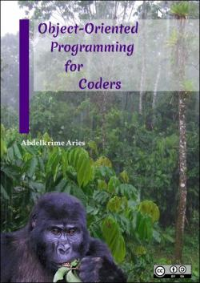

# Object-oriented programming for coders

There are a lot of books which talk about OOP philosophy.
So, if you want to go deeper into OOP paradigm, this isn't your place.
In this book, I want to focus on OOP from developers (programmer's) point of view.
The different implementations of OOP concepts in most object-oriented programming languages.
To this end, I will choose some programming languages, the free ones, to express that.

So, "**Less talking, more coding**"

## Download

Download the latest version from [HERE](https://github.com/kariminf/oop4coders/releases/latest).
There are two files:
* oop4coders_book_version.pdf : The book in pdf format
* oop4coders_codes_version.zip : The codes

## License

Copyright (C) 2016-2018  Abdelkrime Aries

This project has two different licenses: the codes and the book.

## Codes' license

The codes, present in here, including latex files.
Licensed under [MIT](https://opensource.org/licenses/MIT) license

## Book's license

The book is licensed under
[Attribution-ShareAlike 4.0 International (CC BY-SA 4.0)](https://creativecommons.org/licenses/by-sa/4.0/)

**You are free to:**
* Share — copy and redistribute the material in any medium or format
* Adapt — remix, transform, and build upon the material for any purpose, even commercially.

The licensor cannot revoke these freedoms as long as you follow the license terms.

**Under the following terms:**
* Attribution — You must give appropriate credit, provide a link to the license, and indicate if changes were made. You may do so in any reasonable manner, but not in any way that suggests the licensor endorses you or your use.
* ShareAlike — If you remix, transform, or build upon the material, you must distribute your contributions under the same license as the original.
* No additional restrictions — You may not apply legal terms or technological measures that legally restrict others from doing anything the license permits.
